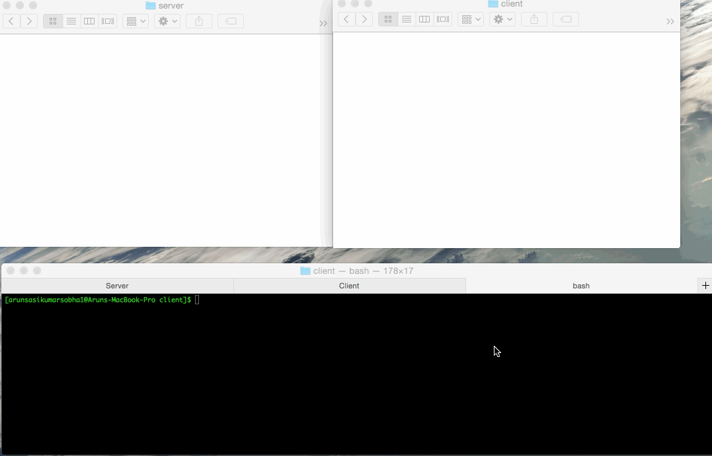

## Dropbox [(raw)](https://gist.github.com/CrabDude/040af9c1b93e350608ff/raw)

This is a basic Dropbox clone to sync files across multiple remote folders.

Time spent: `<10>`

### Features

#### Required

- [X] Walkthrough Gif embedded in README
- [X] README `Time spent:` includes the number of hours spent on the assignment
- [X] Client can make GET requests to get file or directory contents
- [ ] Client can download a directory as an archive
- [X] Client can make HEAD request to get just the GET headers 
- [X] Client can make PUT requests to create new directories and files with content
- [X] Client can make POST requests to update the contents of a file
- [X] Client can make DELETE requests to delete files and folders
- [X] Server will serve from `--dir` or cwd as root
- [X] Server will sync `HTTP` modifications over TCP to the Client
- [X] Server will sync watched file modifications (e.g., `fs.watch`) over TCP to the Client

### Walkthrough

`<Add your Walkthrough Gif here (by updating the image URL)>`

